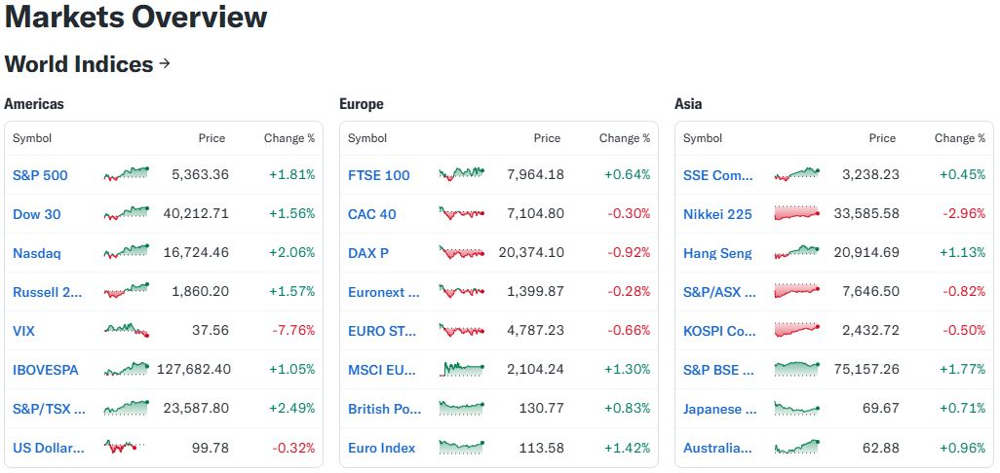

--- 
title: "Faros del Mercado: Índices Bursátiles que Guían la Economía Mundial."
author: "Paolo De La Hoz Vicari, Genjis Ossa Gonzales"
date: "`r Sys.Date()`"
site: bookdown::bookdown_site
documentclass: book
bibliography: [book.bib]
description: Serie de tiempo
link-citations: yes
github-repo: null
output:
  bookdown::gitbook:
    code_folding: hide
---
# Descripción del proceso y justificación del análisis de los valores bursátiles en los principales mercados globales: Estados Unidos, Europa y Asia.

## Descripción del proyecto.
El proyecto se centrará en tres regiones clave: Estados Unidos (S&P 500, NASDAQ, Dow Jones), Europa (DAX, CAC 40, FTSE 100) y Asia (Nikkei 225, Hang Seng, Shanghai Composite). Para cada índice, se recopilará información histórica diaria sobre precios de cierre, volumen y variación porcentual.

Posteriormente, se realizará una limpieza y estructuración de los datos, seguida de un análisis exploratorio para identificar patrones, estacionalidades y correlaciones. A partir de esto, se aplicarán modelos de pronóstico como ARIMA, Prophet o técnicas de aprendizaje automático para estimar las tendencias futuras. El objetivo es generar una herramienta que permita anticipar cambios significativos y pronosticar valores en los mercados para la toma de decisiones.

## Justificación e importancia  del análisis.

En el actual entorno económico, caracterizado por una creciente interconexión y volatilidad, el análisis y pronóstico de los valores de acciones en los principales mercados financieros es esencial para comprender las dinámicas económicas internacionales, anticipar crisis, identificar oportunidades de inversión y formular políticas económicas informadas.El análisis de los valores bursátiles en los principales mercados financieros (Estados Unidos, Europa y Asia) es fundamental para la toma de decisiones estratégicas en contextos económicos globalizados. Estos mercados, representan los polos financieros más influyentes del mundo, cuyas dinámicas afectan directa e indirectamente a las economías emergentes, al comercio internacional y a la inversión institucional y minorista.

El análisis y pronóstico de estos valores permite anticipar tendencias, gestionar riesgos, optimizar carteras de inversión, comprender la interacción entre factores macroeconómicos (PIB, inflación, tasas de interés), eventos exógenos (guerras, pandemias, desastres naturales) y dinámicas propias de cada región (regulaciones, política monetaria, innovación tecnológica). Siendo una herramienta esencial tanto para inversores individuales como para instituciones financieras globales. Además, brinda información clave sobre la salud económica y la proyección futura de regiones que representan más del 75% del PIB mundial. Esta información no solo es clave para inversionistas, sino también para instituciones públicas y privadas que buscan estabilidad financiera, planificación a largo plazo y toma de decisiones estratégicas.

En el caso de Estados Unidos, el mercado bursátil (representado por índices como el S&P 500, NASDAQ y Dow Jones) es considerado un barómetro global de confianza económica y tecnológica. Su influencia es tal que las decisiones de la Reserva Federal o los resultados trimestrales de empresas como Apple o Microsoft pueden generar reacciones en cadena en los demás continentes.

Europa, a través de bolsas como la de Frankfurt (DAX), París (CAC 40) o Londres (FTSE 100), representa un mercado con alta diversificación industrial, energética y financiera. Su relevancia radica en ser un punto de referencia para políticas regulatorias, estabilidad monetaria (especialmente en la zona euro) y tensiones geopolíticas que afectan la confianza de los inversionistas.

Finalmente, Asia, con focos principales en Japón (Nikkei 225), China (Shanghai Composite) y Hong Kong (Hang Seng), constituye el eje de crecimiento económico más dinámico. China en particular, como segunda economía mundial, tiene un impacto decisivo en cadenas de suministro, comercio exterior y mercados emergentes.
<center>


</center>
# Referencias

* Bloomberg Markets: https://www.bloomberg.com/markets

* Yahoo Finance: https://finance.yahoo.com

* World Bank Data: https://data.worldbank.org

* Financial Times – Markets: https://www.ft.com/markets

# Desarrollo Actividad 2.
## Preprocesamiento de datos.
### Cargar las librerías necesarias
```{r setup, message=FALSE, warning=FALSE}
library(quantmod)   # Para descargar datos financieros
library(dplyr)      # Para manipular datos
library(zoo)        # Para series de tiempo basadas en fechas
library(ggplot2)    # Para gráficos
library(tidyr)      # Para transformar los datos
library(urca)
library(tseries)
library(plotly)
library(forecast)
```
### Definimos los índices bursátiles de interés (Yahoo Finance symbols).
```{r, message=FALSE, warning=FALSE}

indices <- c("^GSPC", "^DJI", "^IXIC", "^GDAXI", "^FCHI", "^FTSE", "^N225", "^HSI", "000001.SS")
```
### Descargamos los datos de Yahoo Finance desde el 2019.
```{r, message=FALSE, warning=FALSE}

lista_indices <- lapply(indices, function(ticker) {
  getSymbols(ticker, src = "yahoo", from = "2019-01-01", auto.assign = FALSE)
})
```
### Asignamos nombres a cada índice.
```{r, message=FALSE, warning=FALSE}


nombres_indices <- c("SP500", "DowJones", "Nasdaq", "DAX", "CAC40", "FTSE100", "Nikkei225", "HangSeng", "ShanghaiComposite")
names(lista_indices) <- nombres_indices
```
### Extraemos solo los precios de cierre y convertimos cada serie en un objeto zoo.
```{r, message=FALSE, warning=FALSE}

cierres_zoo <- lapply(lista_indices, function(serie) {
  zoo(Cl(serie))  # Cl() extrae el 'Close' y zoo() lo convierte a objeto de series de tiempo
})
```

### Unimos todas las series zoo en un solo objeto.
```{r, message=FALSE, warning=FALSE}
cierres_merged <- do.call(merge, cierres_zoo)
```
### Visualizamos la estructura.
```{r, message=FALSE, warning=FALSE}

head(cierres_merged)
```
## Gráfico de evolución histórica de todos los índices.
### Convertir a un data frame para ggplot y reestructuración en formato largo para gráficos.
```{r, message=FALSE, warning=FALSE}
cierres_df <- data.frame(Date = index(cierres_merged), coredata(cierres_merged))

cierres_long <- cierres_df %>%
  pivot_longer(cols = -Date, names_to = "Indice", values_to = "Cierre")
```
### Gráfico.

El gráfico muestra la evolución diaria de los precios de cierre de los principales índices bursátiles a nivel mundial desde 2019 hasta la fecha actual. Cada línea representa un índice diferente, con escalas independientes de precio en el eje Y y fechas en el eje X.

Eje X: Fecha (de 2019 a 2025).

Eje Y: Precio de cierre (escala real de cada índice).

Variables representadas: SP500, Dow Jones, Nasdaq, DAX, CAC40, FTSE100, Nikkei225, Hang Seng, Shanghai Composite.
```{r, message=FALSE, warning=FALSE}
ggplot(cierres_long, aes(x = Date, y = Cierre, color = Indice)) +
  geom_line() +
  labs(
    title = "Evolución histórica de índices bursátiles (2019-Actualidad)",
    x = "Fecha",
    y = "Precio de Cierre",
    color = "Índice"
  ) +
  theme_minimal()
```

## Promedios Móviles

### Aplicamos promedio móvil (7, 30, 90 días) para cada índice.
```{r, message=FALSE, warning=FALSE}
promedios_moviles <- lapply(cierres_zoo, function(serie) {
  data.frame(
    Fecha = index(serie),
    Original = as.numeric(serie),
    MA_7 = as.numeric(rollmean(serie, k = 7, fill = NA, align = "right")),
    MA_30 = as.numeric(rollmean(serie, k = 30, fill = NA, align = "right")),
    MA_90 = as.numeric(rollmean(serie, k = 90, fill = NA, align = "right"))
  )
})
```

### Asignamos los nombres de los indices
```{r, message=FALSE, warning=FALSE}
names(promedios_moviles) <- nombres_indices
```

### Graficamos los promedios móviles en todos los indices con (7, 30, 90 días)

**SP500:** Crecimiento fuerte post-pandemia, promedios móviles confirman tendencia alcista estructural, recuperación rápida tras caídas.

**Dow Jones:** Crecimiento sostenido, mayor sensibilidad a choques globales, MA_90 actúa como soporte de tendencia.

**Nasdaq:** Expansión explosiva durante 2020-2022, correcciones posteriores, fuerte volatilidad de corto plazo.

**DAX:** Recuperación sólida, crecimiento más moderado que SP500, volatilidad controlada en 2023-2024.

**CAC40:** Crecimiento progresivo, recuperación fuerte post-pandemia, estabilidad pese a contexto europeo incierto.

**FTSE100:** Recuperación más lenta, crecimiento más estable pero menos acelerado, reflejando impacto de Brexit y COVID-19.

**Nikkei225:** Crecimiento firme y constante, volatilidad moderada, estabilidad asiática frente a shocks externos.

**HangSeng:** Tendencia decreciente persistente, afectado por tensiones políticas y regulación, no logra recuperación estructural.

**Shanghai Composite:** Oscilaciones cíclicas sin tendencia fuerte, movimientos suaves ligados a política económica interna.

```{r, message=FALSE, warning=FALSE}
graficar_promedios_moviles <- function(df, nombre_indice) {
  df_long <- df %>%
    pivot_longer(cols = c("Original", "MA_7", "MA_30", "MA_90"), 
                 names_to = "Serie", values_to = "Valor")
  
  ggplot(df_long, aes(x = Fecha, y = Valor, color = Serie)) +
    geom_line() +
    labs(
      title = paste(nombre_indice, "- Evolución y Promedios Móviles (7, 30, 90 días)"),
      x = "Fecha",
      y = "Precio",
      color = "Serie"
    ) +
    theme_minimal()
}

for (indice in nombres_indices) {
  print(graficar_promedios_moviles(promedios_moviles[[indice]], indice))
}
```

## AutoCorrelación ACF
### Graficamos la autocorrelación (ACF) en todos los indices.
**SP500:**	Presenta autocorrelaciones extremadamente altas en todos los lags. Indica muy alta dependencia temporal, el precio de hoy está casi totalmente explicado por el precio de ayer, anteayer, etc.

**DowJones:**	Patrón idéntico al SP500, autocorrelaciones cercanas a 1 hasta el lag 30. Confirma fuerte persistencia y memoria de largo plazo en el comportamiento de precios.

**Nasdaq:**	Igual que SP500 y DowJones, persistencia total en los precios diarios. Movimiento fuertemente dependiente de valores anteriores. Alta estabilidad interna.

**DAX:**	Alta autocorrelación, pero comienza a decrecer muy lentamente conforme aumenta el lag. Muestra persistencia, aunque ligeramente menos rígida que en índices estadounidenses.

**CAC40:**	Comportamiento muy similar al DAX con alta autocorrelación inicial, pero con una leve pendiente descendente a partir del lag 10. Indica ligero debilitamiento de la dependencia en el tiempo.

**FTSE100:**	Alta autocorrelación, pero con una pendiente descendente más pronunciada que en DAX o CAC40. La dependencia de precios pasados existe pero se va diluyendo más rápido.

**Nikkei225:**	Persistencia fuerte (autocorrelaciones cercanas a 1), aunque ligeramente más "sueltas" que en los mercados occidentales. Los precios tienden a ser explicados por valores pasados, pero hay algo más de ruido.

**HangSeng:**	Alta autocorrelación inicial, pero decayendo progresivamente con el lag. Refleja una memoria de precios, aunque menos estable y más volátil que SP500 o DowJones.

**Shanghai Composite:**	Es el único donde la autocorrelación desciende de forma continua y más marcada a medida que crece el lag. Esto indica que la memoria de los precios se erosiona rápidamente en China. Mayor aleatoriedad y menor persistencia estructural en los precios.

```{r, message=FALSE, warning=FALSE}

graficar_acf <- function(serie, nombre_indice) {
  serie_sin_na <- na.omit(serie)  # 1. Eliminar los valores faltantes (NA)
  acf(coredata(serie_sin_na),     # 2. Calcula autocorrelaciones
      lag.max = 30,               # 3. Mide autocorrelaciones hasta 30 rezagos (lags)
      main = paste("Autocorrelación (ACF) -", nombre_indice))  # 4. Título del gráfico
}

# Aplicar la función a todos los índices
for (indice in nombres_indices) {
  graficar_acf(cierres_zoo[[indice]], indice)
}
```

## Descomposición de serie de tiempo.
### Descomponemos y graficamos los indices bursatiles utilizando la forma clasica y STL con pasos de limpieza e implementación.
```{r, message=FALSE, warning=FALSE}
descomponer_y_graficar <- function(serie_zoo, nombre_indice) {
  
  # Eliminamos NA
  serie_limpia <- na.omit(serie_zoo)
  
  # Convertimos a vector numérico puro
  valores_numericos <- as.numeric(serie_limpia)
  
  # Convertimos a objeto ts
  serie_ts <- ts(valores_numericos,
                 start = c(2019, 1),
                 frequency = 252)
  
  # Graficamos descomposición clásica
  plot(decompose(serie_ts))
  mtext(paste("Descomposición Clásica -", nombre_indice), side = 3, line = 1, cex = 1.5)
  
  # Graficamos descomposición STL
  plot(stl(serie_ts, s.window = "periodic"))
  mtext(paste("Descomposición STL -", nombre_indice), side = 3, line = 1, cex = 1.5)
}
# Aplicamos la función a todos los índices
for (indice in nombres_indices) {
  descomponer_y_graficar(cierres_zoo[[indice]], indice)
}
```

## Tabla de resumen con tendencia, estacionalidad y ruido; para todos los indices.

```{r, message=FALSE, warning=FALSE}
analizar_comportamiento <- function(serie_zoo) {
  serie_limpia <- na.omit(serie_zoo)

  # Validar que tenga suficientes datos
  if (length(serie_limpia) < 30) {
    return(c(Tendencia = NA, Estacionalidad = NA, Ruido = NA))
  }

  valores <- as.numeric(serie_limpia)
  ts_serie <- ts(valores, start = c(2019, 1), frequency = 252)

  # Intentar descomposición STL
  descomposicion <- tryCatch({
    stl(ts_serie, s.window = "periodic")
  }, error = function(e) {
    return(NULL)
  })

  if (is.null(descomposicion)) {
    return(c(Tendencia = NA, Estacionalidad = NA, Ruido = NA))
  }

  trend <- descomposicion$time.series[, "trend"]
  seasonal <- descomposicion$time.series[, "seasonal"]
  remainder <- descomposicion$time.series[, "remainder"]

  # Validar que trend tenga al menos dos valores válidos
  if (sum(!is.na(trend)) < 2) {
    return(c(Tendencia = NA, Estacionalidad = NA, Ruido = NA))
  }

  # Extraer extremos no NA para la tendencia
  primer_valido <- trend[which(!is.na(trend))[1]]
  ultimo_valido <- trend[rev(which(!is.na(trend)))[1]]
  media_trend <- mean(trend, na.rm = TRUE)

  # Calcular cambio de tendencia de forma segura
  cambio_tendencia <- (ultimo_valido - primer_valido) / media_trend

  if (is.na(cambio_tendencia)) {
    tendencia_eval <- NA
  } else if (abs(cambio_tendencia) > 0.1) {
    tendencia_eval <- ifelse(cambio_tendencia > 0, "Creciente", "Decreciente")
  } else {
    tendencia_eval <- "Estable"
  }

  promedio_nivel <- mean(valores, na.rm = TRUE)
  amplitud_estacional <- max(seasonal, na.rm = TRUE) - min(seasonal, na.rm = TRUE)

  estacionalidad_eval <- if ((amplitud_estacional / promedio_nivel) > 0.05) {
    "Fuerte"
  } else {
    "Débil"
  }

  sd_ruido <- sd(remainder, na.rm = TRUE)
  ruido_eval <- if ((sd_ruido / promedio_nivel) > 0.05) {
    "Alto"
  } else {
    "Moderado"
  }

  return(c(Tendencia = tendencia_eval, Estacionalidad = estacionalidad_eval, Ruido = ruido_eval))
}

# Aplicar la función a todos los índices
resumen_automatico <- t(sapply(cierres_zoo, analizar_comportamiento))

# Convertir a data frame con nombres claros
resumen_automatico_df <- data.frame(
  Indice = rownames(resumen_automatico),
  Tendencia = resumen_automatico[, "Tendencia"],
  Estacionalidad = resumen_automatico[, "Estacionalidad"],
  Ruido = resumen_automatico[, "Ruido"],
  row.names = NULL
)

# Mostrar tabla
knitr::kable(
  resumen_automatico_df,
  caption = "Resumen automático de la tendencia, estacionalidad y ruido observados por índice (basado en descomposición STL)."
)
```
## Mapa de calor
```{r, message=FALSE, warning=FALSE}

#  Usamos el resumen automático que ya creamos
resumen_mapa <- resumen_automatico_df

#  Codificar las variables cualitativas a valores numéricos
resumen_mapa_numeric <- resumen_mapa %>%
  mutate(
    Tendencia = case_when(
      Tendencia == "Creciente" ~ 1,
      Tendencia == "Decreciente" ~ -1,
      Tendencia == "Estable" ~ 0,
      TRUE ~ NA_real_
    ),
    Estacionalidad = case_when(
      Estacionalidad == "Fuerte" ~ 1,
      Estacionalidad == "Débil" ~ 0,
      TRUE ~ NA_real_
    ),
    Ruido = case_when(
      Ruido == "Alto" ~ 1,
      Ruido == "Moderado" ~ 0,
      TRUE ~ NA_real_
    )
  )

#  Reorganizar el dataframe en formato largo para ggplot
resumen_long <- resumen_mapa_numeric %>%
  pivot_longer(cols = c(Tendencia, Estacionalidad, Ruido),
               names_to = "Caracteristica",
               values_to = "Valor")

#  Crear el Heatmap
ggplot(resumen_long, aes(x = Caracteristica, y = Indice, fill = Valor)) +
  geom_tile(color = "white") +
  scale_fill_gradient2(
    low = "red", mid = "white", high = "green", midpoint = 0,
    limits = c(-1, 1),
    name = "Nivel"
  ) +
  labs(
    title = "Mapa de Calor: Tendencia, Estacionalidad y Ruido por Índice",
    x = "Componente",
    y = "Índice Bursátil"
  ) +
  theme_minimal() +
  theme(axis.text.x = element_text(angle = 45, hjust = 1))

```

# Desarrollo Actividad 3.
## Validación de supuestos e implementación de transformaciones requeridas en las series.
### Procesos implementados.
Antes de aplicar modelos de pronóstico, es esencial garantizar que las series de tiempo cumplan ciertos supuestos que permiten una estimación confiable y precisa. En esta etapa del análisis, nos enfocamos en evaluar tres aspectos fundamentales de cada índice bursátil: variabilidad relativa, estabilidad estadística (estacionariedad) y la necesidad de transformaciones.

**1. Análisis de la Variabilidad Relativa.**

Cada serie temporal fue evaluada con base en su coeficiente de variación (CV), que representa la relación entre la desviación estándar y la media de la serie. Este valor permite determinar si la serie presenta heterocedasticidad, es decir, si su variabilidad aumenta proporcionalmente con su nivel.

**Criterio aplicado:** Si el coeficiente de variación es mayor a 0.2, se considera que la serie tiene una alta variabilidad relativa y, por tanto, es candidata a una transformación logarítmica.

**2. Transformación Logarítmica.**

Cuando una serie mostró un CV > 0.2, se aplicó una transformación logarítmica. Esta transformación tiene como objetivo estabilizar la varianza, lo cual es crucial para mantener la consistencia de los modelos predictivos. La transformación convierte cambios absolutos crecientes en cambios relativos constantes, facilitando la detección de patrones.

**Resultado:** En los índices SP500, Nasdaq y Nikkei225, por ejemplo, se aplicó esta transformación al superar el umbral de CV.

**3. Evaluación de Estacionariedad con Dickey-Fuller.**

Para verificar la estabilidad estadística de la serie en el tiempo (es decir, su estacionariedad), se utilizó la prueba de Dickey-Fuller aumentada (ADF). Esta prueba contrasta la hipótesis nula de que la serie no es estacionaria.

**Criterio aplicado:** Si el p-valor obtenido es menor a 0.05, se rechaza la hipótesis nula y se considera que la serie es estacionaria. Si el p-valor es mayor, se concluye que la serie no es estacionaria y se requiere una diferenciación.

**4. Diferenciación:** 

Cuando fue necesario, se aplicó la diferenciación de primer o segundo orden, utilizando la función ndiffs(), hasta lograr que la serie cumpla con el criterio de estacionariedad (p-valor < 0.05 en la prueba ADF aplicada a la serie diferenciada).

### Resumen del análisis de estacionariedad por índice bursátil

**SP500**

Transformación logarítmica: Sí (CV = 0.225)

p-valor Dickey-Fuller: 0.00848

¿Diferenciación aplicada?: No. La serie ya es estacionaria.

**DowJones**

Transformación logarítmica: No (CV = 0.165)

p-valor Dickey-Fuller: 0.00413

¿Diferenciación aplicada?: No. La serie ya es estacionaria.

**Nasdaq**

Transformación logarítmica: Sí (CV = 0.263)

p-valor Dickey-Fuller: 0.02449

¿Diferenciación aplicada?: No. La serie ya es estacionaria.

**DAX**

Transformación logarítmica: No (CV = 0.185)

p-valor Dickey-Fuller: 0.09312 (no estacionaria)

Diferenciación aplicada: Sí, orden 1

p-valor tras diferenciación: 0.00000

Resultado final: La serie diferenciada es estacionaria.

**CAC40**

Transformación logarítmica: No (CV = 0.156)

p-valor Dickey-Fuller: 0.00247

¿Diferenciación aplicada?: No. La serie ya es estacionaria.

**FTSE100**

Transformación logarítmica: No (CV = 0.093)

p-valor Dickey-Fuller: 0.00478

¿Diferenciación aplicada?: No. La serie ya es estacionaria.

**Nikkei225**

Transformación logarítmica: Sí (CV = 0.208)

p-valor Dickey-Fuller: 0.00237

¿Diferenciación aplicada?: No. La serie ya es estacionaria.

**HangSeng**

Transformación logarítmica: No (CV = 0.182)

p-valor Dickey-Fuller: 0.01316

¿Diferenciación aplicada?: No. La serie ya es estacionaria.

**ShanghaiComposite**

Transformación logarítmica: No (CV = 0.078)

p-valor Dickey-Fuller: 0.00048

¿Diferenciación aplicada?: No. La serie ya es estacionaria.

### Creamos el objeto tabla del resumen final.
```{r, message=FALSE, warning=FALSE}
# Crear tabla resumen para hallazgos
resumen_estacionariedad <- data.frame(
  Indice = character(),
  CV = numeric(),
  LogTransform = character(),
  DickeyFuller_pvalor = numeric(),
  Diferenciacion = character(),
  stringsAsFactors = FALSE
)

```

### Implementación de procesos sobre los índices bursátile en tres etapas: limpieza, transformación (si aplica), y verificación de estacionariedad, con visualizaciones intermedias. 
```{r, message=FALSE, warning=FALSE}
# Lista para guardar las series procesadas
series_preparadas <- list()
analizar_estacionariedad_transformacion <- function(serie_zoo, nombre_indice) {
  
  cat("\n\n==================================================\n")
  cat("ANÁLISIS DE:", nombre_indice, "\n")
  cat("==================================================\n")
  
  # Limpieza de la serie
  serie <- na.omit(serie_zoo)
  ts_serie <- ts(as.numeric(serie), frequency = 252, start = c(2019, 1))
  
  # Coeficiente de variación
  coef_var <- sd(ts_serie) / mean(ts_serie)
  necesita_log <- coef_var > 0.2
  
  if (necesita_log) {
    ts_trans <- log(ts_serie)
    plot(ts_trans, main = paste("Serie Transformada (Log) -", nombre_indice),
         xlab = "Tiempo", ylab = "log(Precio)")
    cat("Transformación logarítmica aplicada (CV =", round(coef_var, 3), ")\n")
  } else {
    ts_trans <- ts_serie
    plot(ts_trans, main = paste("Serie Original -", nombre_indice),
         xlab = "Tiempo", ylab = "Precio")
    cat("No se aplica transformación logarítmica (CV =", round(coef_var, 3), ")\n")
  }
  
  # Prueba Dickey-Fuller
  prueba_df <- ur.df(ts_trans, type = "trend", selectlags = "AIC")
  pvalor_df <- summary(prueba_df)@testreg$coefficients[2, 4]
  cat("p-valor Dickey-Fuller:", round(pvalor_df, 5), "\n")
  
  # Evaluar si se requiere diferenciación
  if (pvalor_df < 0.05) {
    cat("La serie transformada es estacionaria. No se aplica diferenciación.\n")
    serie_final <- ts_trans
    diferenciacion_txt <- "No"
  } else {
    d <- ndiffs(ts_trans)
    ts_diff <- diff(ts_trans, differences = d)
    plot(ts_diff, main = paste("Serie Diferenciada (d =", d, ") -", nombre_indice),
         xlab = "Tiempo", ylab = "Diferencia")
    cat("Serie NO estacionaria. Se aplica diferenciación de orden:", d, "\n")
    
    prueba_df_diff <- ur.df(ts_diff, type = "drift", selectlags = "AIC")
    pvalor_diff <- summary(prueba_df_diff)@testreg$coefficients[2, 4]
    cat("p-valor Dickey-Fuller tras diferenciación:", round(pvalor_diff, 5), "\n")
    
    if (pvalor_diff < 0.05) {
      cat("La serie diferenciada ahora es estacionaria.\n")
    } else {
      cat("Incluso tras diferenciación, la serie NO es estacionaria.\n")
    }
    
    serie_final <- ts_diff
    diferenciacion_txt <- paste("Sí, orden", d)
  }
  
  # Guardar la serie transformada
  series_preparadas[[nombre_indice]] <<- serie_final
  
  # Guardar en tabla resumen
  resumen_estacionariedad <<- rbind(
    resumen_estacionariedad,
    data.frame(
      Indice = nombre_indice,
      CV = round(coef_var, 3),
      LogTransform = ifelse(necesita_log, "Sí", "No"),
      DickeyFuller_pvalor = round(pvalor_df, 5),
      Diferenciacion = diferenciacion_txt
    )
  )
}
```

### Iteramos los indices bursatiles sobre la función realizada.
```{r, message=FALSE, warning=FALSE}
for (indice in nombres_indices) {
  analizar_estacionariedad_transformacion(cierres_zoo[[indice]], indice)
}
```
## Tabla de resumen.
```{r, message=FALSE, warning=FALSE}
knitr::kable(
  resumen_estacionariedad,
  caption = "Resumen del análisis de estacionariedad y transformaciones aplicadas por índice bursátil"
)
```
# Implementación de modelos.

## Validación de los Modelos ARIMA: Diagnóstico de Residuos.

Una vez ajustados los modelos ARIMA para cada índice bursátil, realizamos un proceso riguroso de validación de residuos. Este paso es esencial para comprobar que los supuestos del modelo se cumplen, y por tanto, que los pronósticos generados por los modelos serán confiables.

**1. Selección Automática del Modelo ARIMA.**
Utilizando la función auto.arima() de la librería forecast, se seleccionó automáticamente para cada serie el modelo ARIMA más adecuado, optimizando el criterio AIC. El modelo se representa como ARIMA(p,d,q), donde:

**p:** número de rezagos autorregresivos (AR),

**d:** orden de diferenciación aplicado,

**q:** número de rezagos en el error (MA).

Por ejemplo, el índice SP500 fue modelado con un ARIMA(2,1,2), lo que significa que se usaron dos términos autorregresivos, una diferenciación de orden 1, y dos componentes de media móvil.

**2. Evaluación de la Normalidad de los Residuos**

Se aplicó la prueba de Shapiro-Wilk para evaluar si los residuos del modelo seguían una distribución normal. La hipótesis nula de esta prueba es que los residuos son normales.

**Criterio aplicado:** Si el p-valor < 0.05, se rechaza la hipótesis de normalidad y se concluye que los residuos no son normales.

**Resultados:** En todos los índices, el p-valor fue 0, por lo tanto, ninguna serie presentó residuos normalmente distribuidos.

**3. Evaluación de Independencia: Ruido Blanco.**
Se utilizó la prueba de Ljung-Box sobre los residuos de cada modelo, para detectar si existía autocorrelación significativa. Esta prueba evalúa si los residuos son ruido blanco, es decir, si son impredecibles y no muestran correlación entre ellos.

**Criterio aplicado:** Si el p-valor > 0.05, no se detecta autocorrelación, y se concluye que los residuos son ruido blanco.

## Resumen por Índice Bursátil: Diagnóstico del Modelo ARIMA.

**SP500.**

Modelo ajustado: ARIMA(2,1,2) con término de deriva.
Los residuos no son normales (p = 0), pero sí constituyen ruido blanco (p = 0.56727), lo cual indica un buen ajuste en términos de independencia temporal.

**Dow Jones.**

Modelo ajustado: ARIMA(2,1,2) con deriva.
Los residuos no siguen distribución normal (p = 0), pero son independientes en el tiempo (p = 0.80404), lo que valida el modelo para fines de predicción.

**Nasdaq.**

Modelo ajustado: ARIMA(4,1,3) con deriva.
Aunque los residuos no son normales (p = 0), presentan ruido blanco (p = 0.88196), lo cual respalda la validez del modelo ajustado.

**DAX.**

Modelo ajustado: ARIMA(4,0,3) con media diferente de cero.
Los residuos no son normales (p = 0), pero no presentan autocorrelación significativa (p = 0.08595), por lo que se considera un modelo aceptable.

**CAC40.**

Modelo ajustado: ARIMA(0,1,0).
Los residuos no son normales (p = 0) y sí presentan autocorrelación (p = 0.03156), lo que indica un modelo que no captura completamente la dinámica de la serie.

**FTSE100.**

Modelo ajustado: ARIMA(0,1,0).
Los residuos no son normales (p = 0) y están autocorrelacionados (p = 0.00002), lo que sugiere que el modelo es insuficiente y podría mejorarse.

**Nikkei225.**

Modelo ajustado: ARIMA(1,1,2).
A pesar de que los residuos no son normales (p = 0), sí son ruido blanco (p = 0.62166), lo que respalda su uso en pronósticos.

**Hang Seng.**

Modelo ajustado: ARIMA(0,1,0).
Los residuos no son normales (p = 0), pero no presentan autocorrelación (p = 0.67402), lo cual valida el modelo.

**Shanghai Composite.**
Modelo ajustado: ARIMA(0,1,0).
A pesar de la no normalidad (p = 0), los residuos son ruido blanco (p = 0.39639), lo que indica que el modelo cumple con los supuestos básicos para predicción.

## Implementación del modelo y validación de supuestos.

Para cada serie temporal, se ajustó un modelo ARIMA utilizando un proceso automatizado de selección de parámetros. Posteriormente, se evaluó la validez del modelo a través del análisis de los residuos generados. Este análisis incluyó la verificación de normalidad (mediante la prueba de Shapiro-Wilk) y la independencia temporal (usando la prueba de Ljung-Box). 
Los pasos fueron los siguientes:

**1. Ajuste del modelo ARIMA automáticamente.**
Se utiliza un procedimiento automático (auto.arima) que busca el mejor modelo ARIMA para cada serie, sin considerar estacionalidad.

Este modelo se selecciona con base en criterios como el AIC (Criterio de Información de Akaike), garantizando un equilibrio entre precisión y simplicidad.

**2. Evaluación de los residuos del modelo.**

Una vez ajustado el modelo, se analizan sus residuos (errores de predicción) para verificar si cumple con los supuestos básicos de un buen modelo de series de tiempo:

**a. Comprobación gráfica:**

Se grafican los residuos a lo largo del tiempo para visualizar si hay patrones (no debería haberlos).

Se grafica también la ACF (Función de Autocorrelación) de los residuos para ver si hay dependencia entre errores (idealmente no debe haber).

**b. Prueba de normalidad (Shapiro-Wilk):**

Se verifica si los errores siguen una distribución normal.

Si el valor-p de esta prueba es menor a 0.05, se concluye que los errores no son normales.

Esto es importante porque la normalidad de los residuos ayuda a mejorar la interpretación y precisión de los intervalos de predicción.

**c. Prueba de independencia o ruido blanco (Ljung-Box):**

Se evalúa si los errores están autocorrelacionados o si son esencialmente aleatorios (ruido blanco).

Si el valor-p es mayor a 0.05, se interpreta que no hay autocorrelación, lo que es deseable en un buen modelo.

```{r, message=FALSE, warning=FALSE}
# Creamos tabla resumen de los modelos y residuos
resumen_modelos <- data.frame(
  Indice = character(),
  Modelo = character(),
  Normalidad = character(),
  RuidoBlanco = character(),
  stringsAsFactors = FALSE
)

# Función para ajustar ARIMA y evaluar residuos
evaluar_residuos_arima <- function(ts_final, nombre_indice) {
  cat("\n\n=== Diagnóstico ARIMA -", nombre_indice, "===\n")
  
  modelo <- auto.arima(ts_final, seasonal = FALSE)
  cat("Modelo ajustado:", as.character(modelo), "\n")
  
  residuos <- residuals(modelo)
  
  # Gráfico de residuos
  plot(residuos, main = paste("Residuos ARIMA -", nombre_indice), ylab = "Error", xlab = "Tiempo")
  abline(h = 0, col = "red", lty = 2)
  
  # ACF de residuos
  acf(residuos, main = paste("ACF de Residuos -", nombre_indice))
  
  # Prueba de normalidad (Shapiro-Wilk)
  if (length(residuos) >= 3 & length(residuos) <= 5000) {
    p_normal <- shapiro.test(residuos)$p.value
    normalidad <- ifelse(p_normal < 0.05, "No normal", "Normal")
    cat("p-valor Shapiro-Wilk:", round(p_normal, 5), "-", normalidad, "\n")
  } else {
    normalidad <- "No evaluada"
    cat("Tamaño inadecuado para Shapiro-Wilk.\n")
  }

  # Prueba de independencia (Ljung-Box)
  p_ljung <- Box.test(residuos, lag = 20, type = "Ljung-Box")$p.value
  ruido <- ifelse(p_ljung < 0.05, "Autocorrelados", "Ruido blanco")
  cat("p-valor Ljung-Box:", round(p_ljung, 5), "-", ruido, "\n")
  
  # Guardamos el resultado en la tabla
  resumen_modelos <<- rbind(resumen_modelos, data.frame(
    Indice = nombre_indice,
    Modelo = as.character(modelo),
    Normalidad = normalidad,
    RuidoBlanco = ruido
  ))
}
```

```{r, message=FALSE, warning=FALSE}
for (indice in nombres_indices) {
  evaluar_residuos_arima(series_preparadas[[indice]], indice)
}
```

## Tabla de resumen.
```{r, message=FALSE, warning=FALSE}
knitr::kable(
  resumen_modelos,
  caption = "Resumen del modelo ARIMA y diagnóstico de residuos por índice bursátil"
)
```